# HPC and Sustainability: How Efficiently Are We Using Our Cluster?

*King's Sustainability Month, February 2026*

## Introduction

TODO: Introduce the motivation — HPC clusters consume significant energy, and
using resources efficiently is a sustainability issue. This post analyses
6 months of job data (July–December 2025) from the King's HPC cluster.

## Global Efficiency Stats

### Cluster-Wide Summary

TODO: Summary table — total jobs, mean/median CPU and memory efficiency.

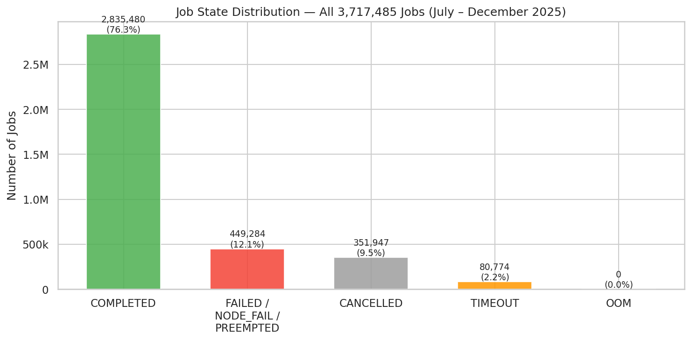

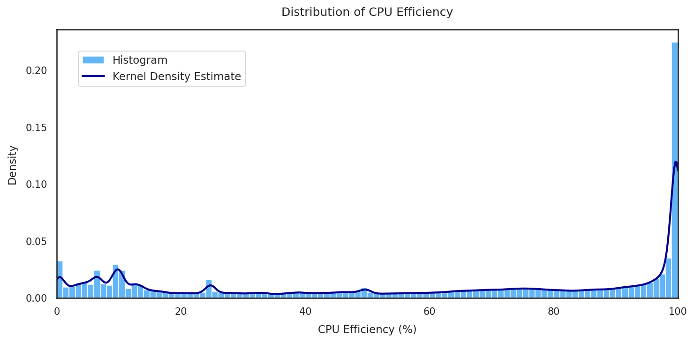

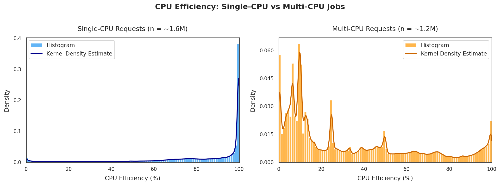

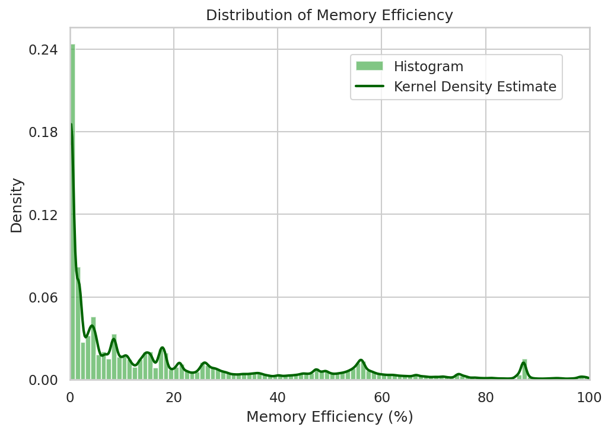

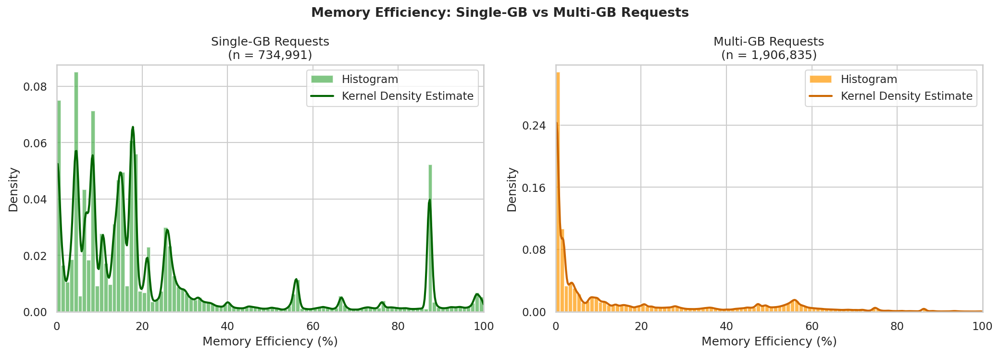

### What Resources Are People Requesting?

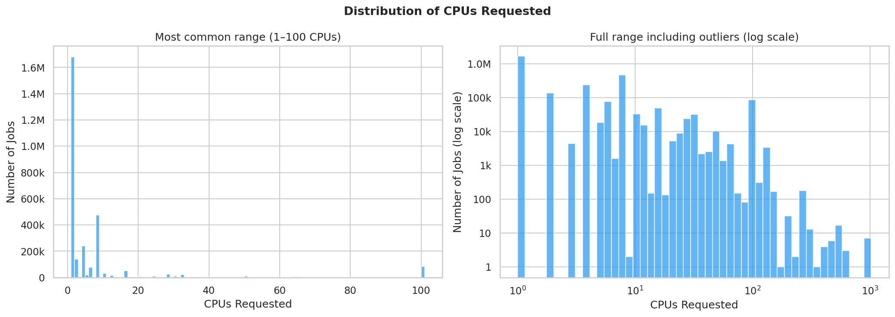

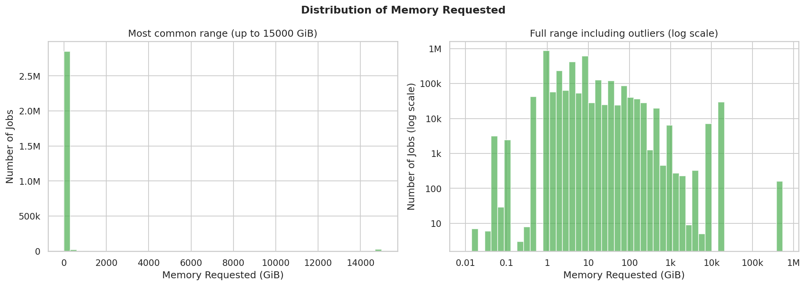

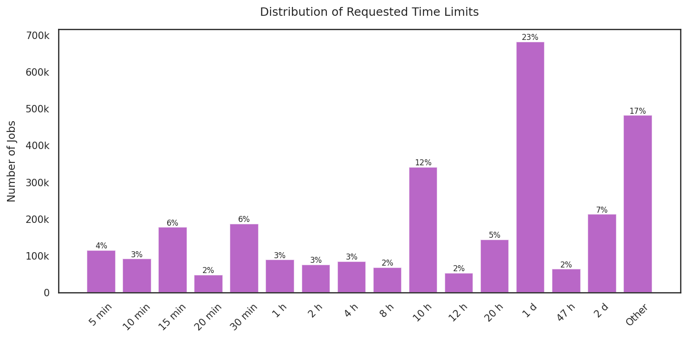

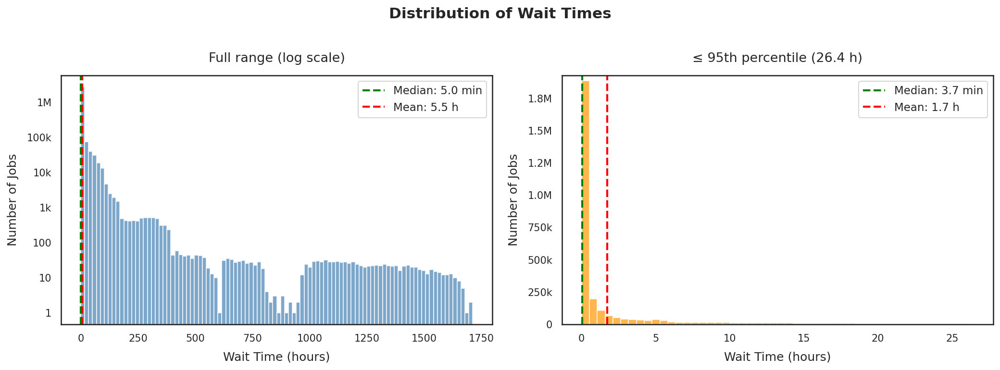

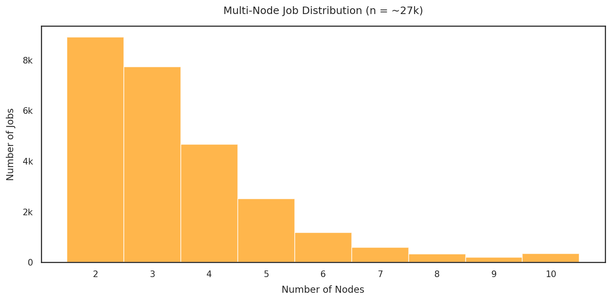

### How Much of Those Resources Goes to Waste?

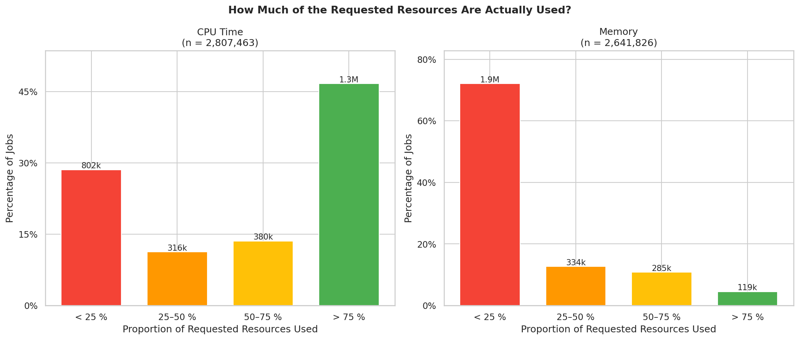

### Requested vs Actually Used

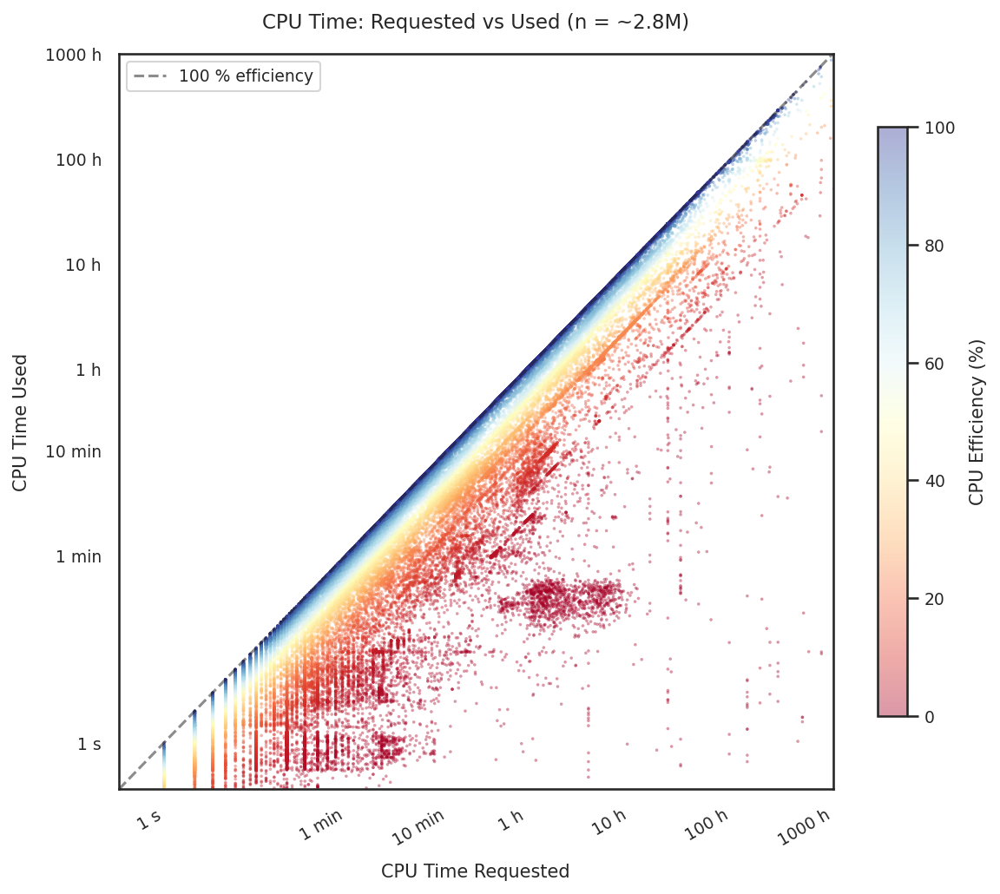

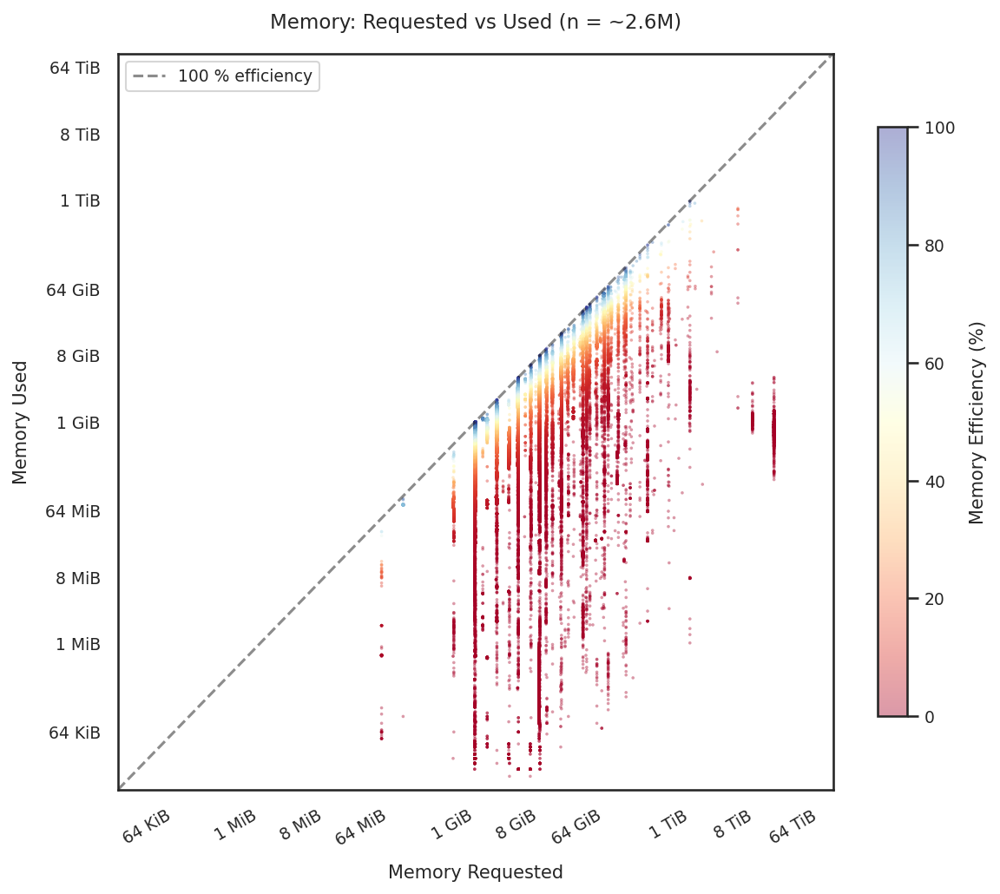

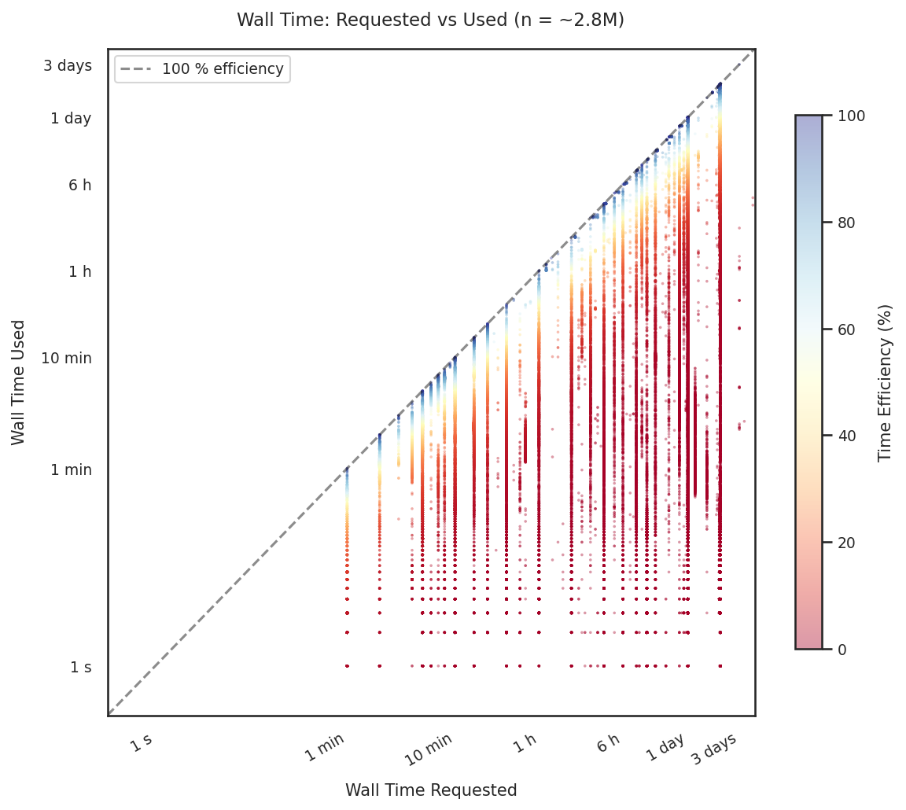

### Are CPU-Efficient Jobs Also Memory-Efficient?

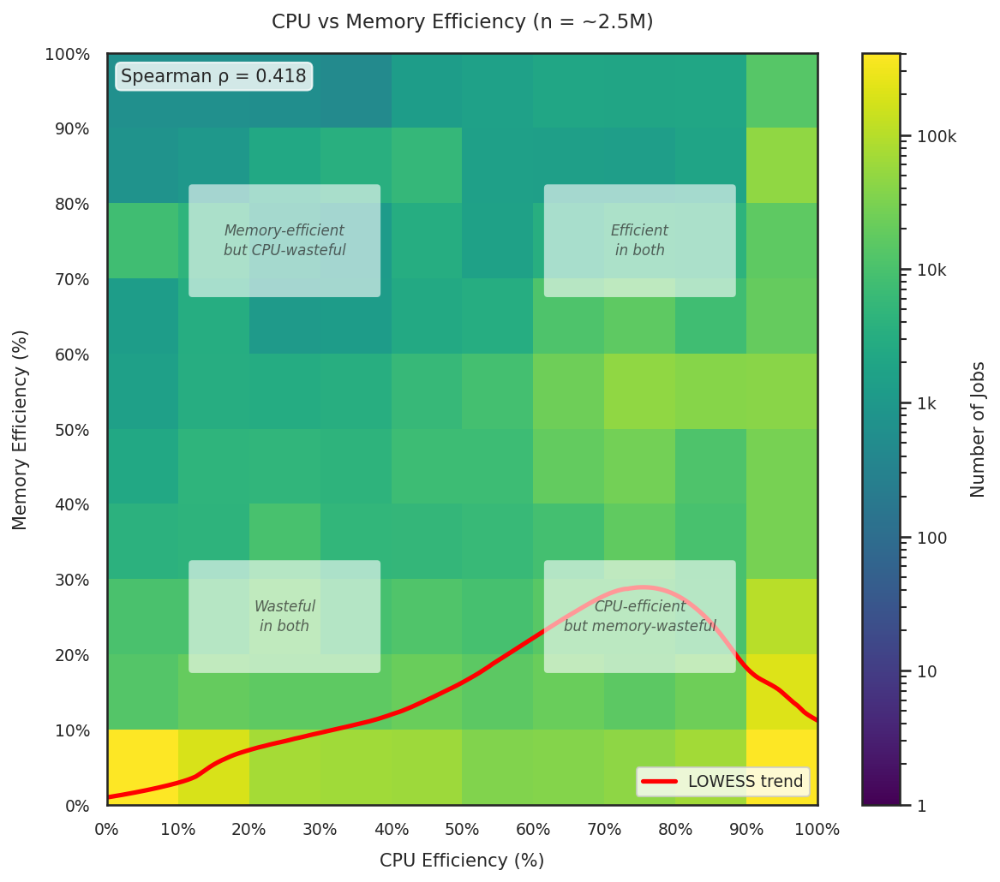

## Faculty Efficiency Stats

### Efficiency Rankings

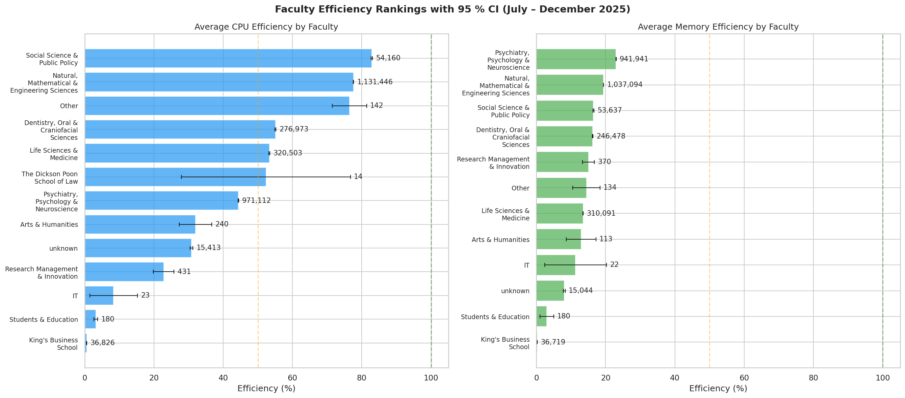

### Efficiency Distributions by Faculty

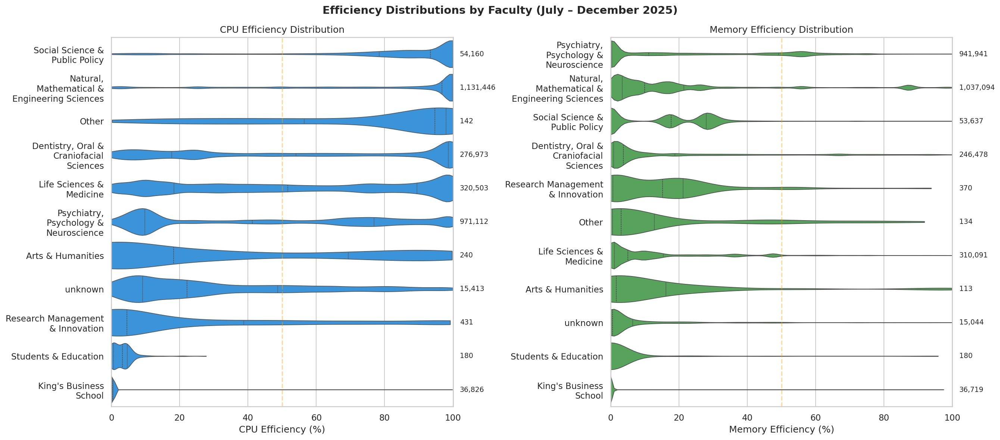

### Job Outcomes by Faculty

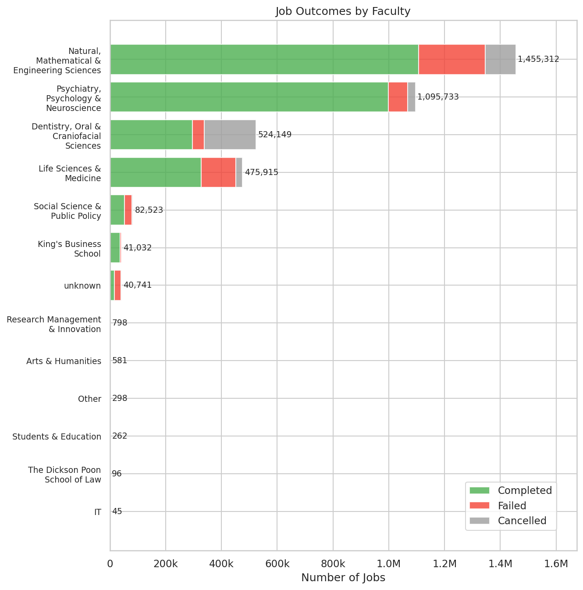

## What Can You Do?

TODO: Practical tips for users to improve efficiency.

## Methodology

TODO: Brief description of data sources and metric definitions.
