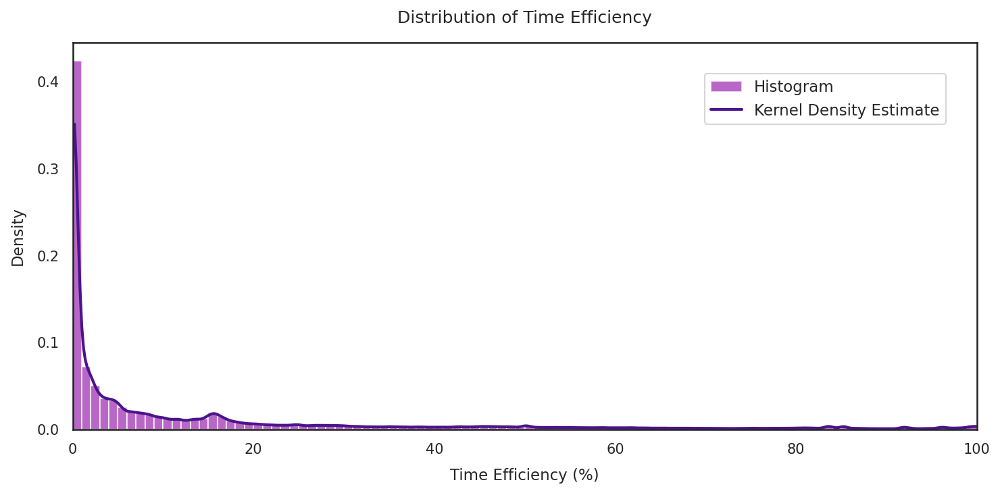
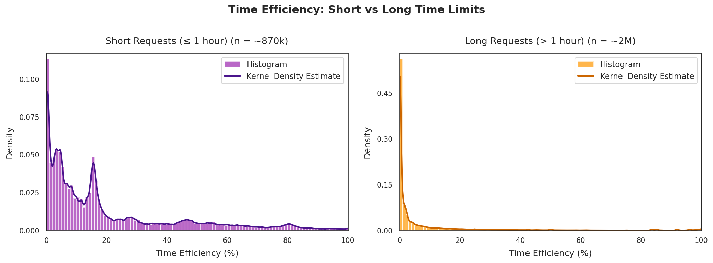

# HPC and Sustainability: How Efficiently Are We Using Our Cluster?

*King's Sustainability Month, February 2026*

## Introduction

An HPC cluster is a shared resource — and like any shared resource, how we use it affects everyone. Every CPU core reserved but unused, every gigabyte of memory allocated but never touched, is a resource that another researcher's job is queuing for. As part of King's Sustainability Month in February, we analysed six months of job data (July–December 2025) from the CREATE HPC cluster to find out: how efficiently are we actually using our resources?

The short answer: there's significant room for improvement. Across ~2.9 million analysed jobs, the average CPU efficiency was 60% and the average memory efficiency was just 19%. These findings were one of the motivations behind launching [`seff`](https://forum.er.kcl.ac.uk/t/new-tool-available-measuring-and-improving-the-efficiency-of-your-hpc-jobs/3269), a tool that lets you check the efficiency of any completed job with a single command. This post presents the full picture — how efficient our jobs are across CPU, memory, and time, where the waste is concentrated, how faculties compare, and what you can do about it.

### Why efficiency matters

When you request resources (CPUs, memory) for a job, those resources are **reserved exclusively for you**, even if your job doesn't use them. This means:

- **Other users can't access those resources** while they sit idle — your unused cores and memory are locked away from everyone else.
- **Queue wait times increase** for everyone, because the scheduler sees the cluster as full when it's actually underutilised.
- **The cluster's throughput drops** — fewer jobs run overall, slowing down research across the board.

In short, over-requesting resources doesn't just waste your own allocation — it directly impacts your colleagues' ability to get their work done. This post is about that kind of efficiency: making the most of the cluster we have, so that everyone gets fair access and faster results.

You might wonder about the energy side of things. The relationship between job efficiency and electricity consumption is more nuanced than it might seem. Most green HPC initiatives focus on areas like carbon-aware scheduling — running jobs when the grid is greener, which [one study](https://arxiv.org/html/2502.09717v1) showed can reduce emissions by up to 33% —, hardware and cooling improvements, or avoiding unnecessary computation altogether  (for a broader overview, see [Palumbo et al., 2024](https://www.sciencedirect.com/science/article/pii/S1364032123008778) and [Clusella et al., 2025](https://www.sciencedirect.com/science/article/pii/S2666789425000789)). None of these are directly about how many CPUs you request. 

The link between job efficiency and sustainability, while indirect, is nonetheless there: as demand for the cluster grows, poor scheduling means capacity runs out sooner — possibly leading to hardware expansion that carries its own CO2 cost in manufacturing and deployment. Moreover, the cluster's hardware has a finite lifespan whether it's fully utilised or not: if widespread over-requesting means the same body of research takes two hardware generations instead of one, that's twice the environmental cost for the same scientific output.

The good news: most inefficiency comes from requesting more than needed, and that's straightforward to fix once you know what to check. 

Let's look at the data. 

## Cluster-Wide Efficiency

### Which Jobs We Included

Between July and December 2025, ~3.7 million jobs were submitted to CREATE HPC. Using data recorded by Slurm — the workload manager that schedules and tracks all jobs on the cluster 
  — we identified ~2.9 million jobs in states suitable for efficiency analysis, i.e., jobs that
- completed successfully (Slurm state `COMPLETED`), 
- ran until their time limit (Slurm state `TIMEOUT`), or 
- were killed for exceeding memory (Slurm state `OUT_OF_MEMORY`). 

The remaining ~800k jobs were excluded because they either didn't run long enough (e.g., Slurm state `CANCELLED`) or terminated abnormally (e.g., Slurm state `FAILED`), making their resource usage unrepresentative. 

For more details on which states were included and why, have a look at the [Appendix](#job-states-included).

In Figure 1, we can see that about three quarters of all submitted jobs completed successfully. Notably, `OUT_OF_MEMORY` — the state assigned when a job is killed for exceeding its memory allocation — is absent from the plot because memory limits were not yet enforced during this period. More on that in the [memory efficiency section](#memory-efficiency-distribution).


*Figure 1: Job state distribution.*


### Average Efficiencies

We measure three types of efficiency: 
- **CPU efficiency** – how much of the allocated CPU time was actually used for computation (if you request 4 CPUs for 1 hour, you have 4 CPU-hours available).
- **Memory efficiency** – a job's peak memory usage compared to the amount requested.
- **Time efficiency** – how much of the requested wall time was used. (Unlike CPU and memory, unused time is not "blocked" — resources are released as soon as a job finishes. But over-requesting time still affects queue wait times, as we'll see below.)

Full definitions and formulas are in the [Appendix](#efficiency-metrics). 

Before diving into the numbers, here's a rough guide for how to interpret efficiency percentages:

|   Range   |   Rating   | Meaning |
|:---------:|:----------:|:--------|
| 80–100%   | Excellent  | Resources well matched to actual usage |
| 60–80%    | Good | Some over-requesting — room for improvement |
| 40–60%      | Moderate | Significant over-requesting — review your resource requests |
| 20–40%      | Poor | Most of your requested resources are going unused |
| <20%      | Very poor | Almost all requested resources are wasted |

Table 1 below shows mean and median efficiencies for CPU, memory, and time. Here, "average efficiency" is the simple mean of per-job efficiency values — it answers the question: what's the _typical_ job's efficiency?

As we can see in Table 1, both the mean and median CPU efficiency fall in the "good" range, though the mean sits at its lower edge. The median is noticeably higher, suggesting that very low CPU efficiencies are the exception rather than the norm — a minority of poorly utilised jobs pulls the mean down. 

For memory, the picture is reversed: both mean and median land in "very poor", with the median worse than the mean. Here, it's high memory efficiency that's rare — most jobs barely use what they request, and a few better-performing jobs pull the mean up. 

Time efficiency is the lowest of the three: a mean of 11.9% and a median of just 2.0%, both deep in "very poor" territory — most jobs finish far before their time limit expires. 

As noted above, time works differently from CPU and memory: once a job finishes, resources are released immediately, so unused time doesn't block them in the same way as unused CPU or memory do. It does, however, increase queue wait time, because the scheduler must find a slot where resources are free for the full requested duration. Requesting a realistic time limit helps your jobs start sooner. We'll return to this in the [time limits section](#time-limits) below.

|         Metric         |  Value  |
|:----------------------|:-------:|
| **CPU**                |         |
| Mean CPU efficiency    |  59.9%  |
| Median CPU efficiency  |  70.6%  |
| **Memory**             |         |
| Mean memory efficiency |  19.3%  |
| Median memory efficiency | 8.5%  |
| **Time**               |         |
| Mean time efficiency   |  11.9%  |
| Median time efficiency |  2.0%   |
*Table 1: Mean/median CPU, memory, and time efficiencies.*

A note on what job efficiencies we excluded: we filtered out jobs with efficiency above 100%, which can arise from Slurm allocating slightly more resources than requested, or from historically unenforced memory limits. We also excluded a small number of jobs with null efficiency values (e.g., due to zero elapsed time). Specifically:
- CPU efficiencies are based on ~2.8M jobs, after excluding ~11.4k (0.4%) with null and ~97.3k (3.4%) with >100% CPU efficiency from the ~2.9M eligible jobs.
- Memory efficiencies are based on ~2.6M jobs, after excluding ~270 (<0.01%) with null and ~274.2k (9.5%) with >100% memory efficiency.
- Time efficiencies are based on ~2.8M jobs, after excluding ~274 (<0.01%) with null, ~8.9k (0.3%) where the time limit was not explicitly set by the user (e.g., jobs that inherited a system-wide maximum rather than a user-specified limit), and ~73.5k (2.5%) with >100% time efficiency.

CPU, memory, and time efficiencies are filtered independently — a job can appear in one metric's plots but not another's. Details are in the [Appendix](#efficiency-metrics). 

To see beyond these summary statistics, let's look at how efficiency is distributed across all jobs — distributions reveal patterns that averages hide, like whether most jobs are reasonably efficient with a few outliers, or whether low efficiency is widespread.

### Efficiency Distributions

#### CPU Efficiency

Figure 2 shows the distribution of CPU efficiency as a histogram with a kernel density estimate overlay. There's a reassuring peak near 100%, but also a long tail stretching all the way down — with a second concentration of jobs in the 0–15% range, suggesting a substantial number of jobs barely use their CPUs at all.


*Figure 2: CPU efficiency distribution.*

The picture changes dramatically when we separate **single-CPU** and **multi-CPU jobs** (Figure 3). Single-CPU jobs make up ~58% of all jobs and show a strong peak near 100% — most are using their one core well. Multi-CPU jobs (~42% of all jobs) tell a different story: the highest density sits in the 0–20% range, suggesting that many jobs request multiple cores but barely use them — likely because the code isn't parallelised, or can't effectively use all the cores requested. 

When you request multiple CPUs, the expectation is that your code splits its work across all of them in parallel. If it doesn't — either because the software needs to be explicitly told to use multiple cores (e.g., via a library), or because only parts of the computation can actually run in parallel — you end up with reserved cores sitting idle.


*Figure 3: CPU efficiency by request size. Left: Jobs requesting one CPU. Right: Jobs requesting more than one CPU. Note that the y-axis scales differ between panels.*

Table 2 quantifies the split: single-CPU jobs have a mean CPU efficiency of 82% and a median of 96% — solidly "excellent". Multi-CPU jobs average just 32%, with a median of 19% — "very poor". This gap is the single biggest driver of CPU inefficiency on the cluster. 

| Metric/request type | Single-CPU | Multi-CPU |
|:----------------------|:-------:|:-------:|
| Mean CPU efficiency |  81.8%  | 31.7% |
| Median CPU efficiency |  95.5%  | 18.6% |

*Table 2: Mean/median CPU efficiency by request type.*

#### Memory Efficiency

Figure 4 shows the distribution of memory efficiency (again as a histogram with KDE overlay). Unlike CPU efficiency, there is no peak near 100%. Instead, the distribution is dominated by a spike near 0%, with most of the density sitting below 10%. Small bumps around 55% and 85% suggest pockets of jobs with well-sized memory requests, but they are the exception.


*Figure 4: Memory efficiency distribution.*

Figure 5 splits this by request size. Jobs requesting ≤1 GiB (~28% of all jobs) show density spread across the 0–30% range with a notable bump near 85–95%, indicating that a reasonable share of these smaller requests are well-sized. Jobs requesting more than 1 GiB (~72% of all jobs) are a different story: nearly all the density is concentrated near 0%, with very little beyond 20%. 

A note on units: Slurm and this analysis report memory in GiB (gibibytes, powers of 1024), not GB (gigabytes, powers of 1000). 1 GiB = 1.074 GB — a small difference, but worth noting for precision.


*Figure 5: Memory efficiency by request size. Left: Jobs requesting ≤ 1 GiB of memory. Right: Jobs requesting more than 1 GiB. Note that the y-axis scales differ between panels.*

Table 3 further puts the split for memory efficiencies into numbers: jobs requesting ≤1 GiB have a mean of 24% and a median of 15% — "poor" but not extreme. Jobs requesting more than 1 GiB have an of average 18% with a median of just 4% — deep in "very poor" territory. Unlike CPU, where single-resource jobs are generally fine, memory efficiency is low across both groups.

| Metric/request type | ≤1 GiB requests | >1 GiB requests |
|:----------------------|:-------:|:-------:|
| Mean memory efficiency    |  23.6%  | 17.6% |
| Median memory efficiency  |  15.3%  | 4.4% |

*Table 3: Mean/median memory efficiency by request type.*

#### Time Efficiency

Figure 6 shows the distribution of time efficiency. The picture is even more extreme than memory: the vast majority of jobs finish using only a small fraction of their requested wall time, with most of the density concentrated near 0%. Unlike CPU and memory, there is essentially no peak near 100% — very few jobs come close to using their full time limit.


*Figure 6: Time efficiency distribution.*

Figure 7 splits this by the length of the time limit requested. Jobs with short time limits (≤1 hour, ~31% of all jobs) show a more spread-out distribution, with visible density across the range. Jobs with longer time limits (>1 hour, ~69% of all jobs) are overwhelmingly concentrated near 0%.


*Figure 7: Time efficiency by request length. Left: Jobs with time limits ≤ 1 hour. Right: Jobs with time limits > 1 hour. Note that the y-axis scales differ between panels.*

Table 4 quantifies the split: short-limit jobs have a mean time efficiency of ~20% and a median of 12%. Long-limit jobs average just 8%, with a median of 0.5%. The longer the time limit, the more of it goes unused.

| Metric/request type | ≤1 hour requests | >1 hour requests |
|:----------------------|:-------:|:-------:|
| Mean time efficiency    |  20.3%  | 8.1% |
| Median time efficiency  |  11.7%  | 0.5% |

*Table 4: Mean/median time efficiency by request length.*

#### A Note on Defaults

The cluster assigns default allocations when no value is specified: 1 CPU, 1 GiB of memory, a 24-hour wall time for batch jobs (submitted via a script and run without user interaction) and 1 hour for interactive jobs (where you get a shell on a compute node).

Many users simply accept these. But a large share of jobs are inherently small: a substantial portion use less than 1 GiB of actual memory (~68%, see also Figure 16), many use less than 1 hour of CPU time (~79%, see also Figure 15), and as we've just seen, the median job finishes using just 2% of its requested time. For these jobs, the defaults are an over-allocation which partly explains the low efficiency numbers above. The 24-hour default time limit is a particularly large contributor to the very low time efficiency: a job that finishes in 30 minutes but was given the default 24 hours has a time efficiency of just 2%. Requesting less than the default takes deliberate effort, but if your jobs consistently use far less, it's worth adjusting your requests downward.

### Are CPU-Efficient Jobs Also Memory-Efficient?

So far, we've looked at CPU, memory, and time efficiency separately. But are they related? For example, do jobs that use their CPUs well also tend to use their memory well? Figure 8 explores this for CPU and memory.

The plot uses two statistical tools suited to this kind of data. The **Spearman rank correlation** (ρ) measures how consistently one variable increases as the other does, without assuming a straight-line relationship — unlike the more common Pearson correlation, which only captures linear trends. This makes it robust to the skewed, non-normal distributions we've seen above. The **LOWESS trend line** (locally weighted scatterplot smoothing) fits a flexible curve through the data by averaging nearby points, revealing the local relationship between CPU and memory efficiency without imposing a particular shape.

The result: a moderate positive correlation — jobs that use their CPUs well tend to use their memory reasonably well too. But the LOWESS curve flattens above ~60% CPU efficiency, showing that this relationship breaks down for the most CPU-efficient jobs. A large fraction of high-CPU-efficiency jobs remains memory-inefficient. This suggests that even users who get CPU parallelisation right are often not sizing their memory requests accurately.


*Figure 8: CPU efficiency vs memory efficiency. The red line is a LOWESS trend; ρ denotes the Spearman rank correlation.*

Overall, the efficiency distributions and correlation above paint a clear picture of widespread over-requesting, particularly for memory and time. In the next section, we look at what people are actually asking for — whether the choices look deliberate or more like guesswork, and what that tells us about where these efficiency patterns come from.

## What Resources Are People Requesting?

The following plots are based on all ~2.9 million efficiency jobs with valid states, regardless of efficiency value.

### CPUs

Figure 9 depicts the distribution of CPU requests on a log scale. As we've already seen above, the majority of jobs request a single CPU, with a median of one CPU and a higher mean at 7.1 CPUs, pulled up by jobs requesting many cores (the 95th percentile is 28 CPUs, with a maximum of 1,024). The next most common requests after 1 are 8 CPUs (16%), 4 CPUs (8%), and 2 CPUs (5%).

Clear peaks at powers of 2 and round numbers (8, 16, 32, 100, 1000) are a sign that many users pcik "nice" numbers and are guessing rather than measuring how many cores their code can use.


*Figure 9: Distribution of requested CPUs (on a log scale).*

### Memory

Figure 10 shows the distribution of memory requests on a log scale. As noted earlier, about 30% of jobs use the 1 GiB default — visible as the tallest peak. Beyond that, requests cluster around round values (2, 4, 8, 10, 100 GiB), echoing the "nice numbers" pattern we saw for CPUs. The median request is 4 GiB and the 95th percentile is 100 GiB. The mean of 219 GiB is misleading — it's pulled up by extreme requests, which is why the median is a much better summary here.

Two anomalous peaks stand out in the tail: one around 5,000–10,000 GiB and another near 500,000 GiB. These are largely explained by a common pitfall. Slurm offers two ways to request memory: a total amount for the whole job, or an amount per allocated CPU. Confusing the two can lead to enormous reservations — for example, requesting 150 GiB per CPU with 100 CPUs reserves 15,000 GiB (nearly 15 TiB). 

Over 37,000 jobs (1.3%) requested more than 1 TiB of memory — and 99.6% of them used the per-CPU memory option. A request of 150 GiB per CPU alone accounts for over 36,000 of these jobs. Just 25 users are responsible for all requests above 1 TiB, while their median actual memory usage is only 0.85 GiB.


*Figure 10: Distribution of requested memory (on a log scale).*

### Time

Figure 11 depicts the distribution of time requests. About a third of jobs (~31%) request up to an hour, and the vast majority (~87%) request a day or less. The median time limit is 10 hours; the 95th percentile is 2 days. The maximum allowed wall time is 48 hours for batch jobs and 4 hours for interactive jobs — but the default, if you don't specify a time limit, is 24 hours for the former, and 1 hour for the latter. 

The most common choice is 24 hours (the default). The "other" category groups all less-common time limits that didn't make the top 15.

A small number of jobs (~9.6k, 0.3%) had time limits exceeding 48 hours, with limits up to ~21 days. These likely ran in partitions with higher limits than the standard configuration.


*Figure 11: Distribution of requested time limits. Each bar shows the count of jobs requesting that specific time limit.*

### Wait Times
As stated above, over-requesting resources increases queue wait times. But how long are users actually waiting? This is worth examining, especially since long wait times have been a recurring concern among users. Table 5 summarises the picture.

While a small fraction of jobs (5%) wait more than ~26 hours, the median wait is just 5 minutes — most jobs start almost immediately. This is good news! Yet tighter resource requests could make it even better for everyone.


|  Statistic  |  Wait time for all jobs   | ≤ 95th percentile |
|:------|:-----------:|:-----------------:|
| Median |   5.0 min   |      3.7 min      |
| Mean   |  5.5 hours  |     1.7 hours     |
| Max    | 1,722 hours |    26.4 hours     |

*Table 5: Mean/median/max wait times for a job to get started.*

Figure 12 shows the distribution in more detail. It is heavily right-skewed: most jobs start within minutes, but a long tail of outliers pulls the mean to 5.5 hours. Excluding the top 5% of wait times brings the mean down to 1.7 hours and caps the maximum at about 26 hours — confirming that extreme waits affect only a small minority of jobs.


*Figure 12: Wait time distribution.*

### Nodes
To complete the picture, we also look at node requests — though these turn out to be straightforward. The vast majority of jobs (99.1%) run on a single node; only ~26.6k jobs (0.9%) used multiple nodes, with a maximum of 20. Figure 13 shows the distribution only for the multi-node jobs.


*Figure 13: Node count distribution for multi-node jobs only (up to the 99th percentile).*

So far, we've looked at efficiency distributions and resource requests separately. In the next section, we bring the two together: how much of the cluster's resources actually goes unused?

## How Much of Those Resources Goes to Waste?

### Waste By Severity

The efficiency numbers above translate into concrete waste. Figure 14 breaks it down using the same five-tier scale introduced earlier.

For CPU, the picture is mixed: about 43% of jobs fall into the "excellent" category (80–100% of resources requested are also used), but a similar share (31%) lands in "very poor" (below 20%), with relatively few jobs in between. For memory, the picture is stark: 72% of jobs use less than 20% of the memory requested, and only 4% use 80% or more.

Among multi-CPU jobs specifically, ~620k (51%) fall into the "very poor" category — using less than 20% of their requested CPU time. Among jobs requesting more than 1 GiB of memory, ~1.3M (69%) are likewise "very poor".


*Figure 14: Waste severity breakdown. Each bar shows the percentage of jobs falling into each waste category. Labels on top of the bars indicate the approximate job count and percentage per category.*

### Requested vs. actually used
Figures 15–17 let us zoom in on individual jobs: each plot shows a random sample of 80,000 jobs, with what was requested on the x-axis and what was actually used on the y-axis — for CPU, memory, and time, respectively. Points on the diagonal represent perfect efficiency; the further a point falls below it, the more was wasted. The colour indicates efficiency percentage.

For all three resources, the scatter falls overwhelmingly below the diagonal — what's requested is often orders of magnitude more than what's used. A few patterns stand out:         
- CPU time (Figure 15): a band of efficient jobs hugs the diagonal, mostly at smaller request sizes — these are largely the single-CPU jobs we saw performing well earlier. Below them, a broad cloud of jobs requests hours to thousands of hours of CPU time but uses only a small fraction. A distinct cluster stands out in the 1–10 CPU-hour request range where actual usage is less than a minute — worth investigating further.
- Memory (Figure 16): dense vertical columns at round request values (1, 4, 8, 64, 100 GiB) show that within each common request size, actual usage spans orders of magnitude. At the far right, jobs requesting TiBs of memory use only MiBs to a few GiBs — these are the extreme over-reservations from the previous section. 
- Wall time (Figure 17): vertical lines at common time limits (1 h, 6 h, 24 h, 2 days) dominate. The 24-hour default stands out most: a dense column of jobs that requested a full day but finished anywhere from seconds to a few hours. A thin band along the diagonal represents jobs that ran until their time limit — the TIMEOUT cases.


*Figure 15: CPU time — requested vs used.*


*Figure 16: Memory — requested vs used.*


*Figure 17: Wall time — requested vs used.*

So far, we've looked at average efficiency and efficiency distributions, resource requests, and waste across all jobs combined — but different research groups use the cluster in different ways. Do some faculties fare better than others? That's what we look at next.

## Efficiency By Faculty

To understand where efficiency varies, we mapped users to faculties via King's Active Directory. The abbreviations used in the plots below are:

| Abbreviation | Faculty |
|:------------:|:--------|
| **NMES**     | Faculty of Natural, Mathematical & Engineering Sciences |
| **IoPPN**    | Institute of Psychiatry, Psychology & Neuroscience |
| **DOCS**     | Faculty of Dentistry, Oral & Craniofacial Sciences |
| **LSM**      | Faculty of Life Sciences & Medicine |
| **SSPP**     | Faculty of Social Science & Public Policy |
| **KBS**      | King's Business School |
| **AH**       | Faculty of Arts & Humanities |
| **RMI**      | Research Management & Innovation |
| **SE**       | Students & Education |
| **DPSL**     | The Dickson Poon School of Law |
| **IT**       | IT |
| **Other**    | Listed as "Other" in Active Directory |
| **N/A**      | Faculty could not be determined (Active Directory lookup failed) |

### Job Outcomes By faculty
Let's first look at who submits the most jobs. Figure 18 shows the outcome of all ~3.7 million submitted jobs, broken down by faculty. The four largest users by job volume are NMES, IoPPN, DOCS, and LSM.


*Figure 18: Job outcomes by faculty. Numbers at the tip of each bar show the approximate total number of jobs submitted per faculty.*

### Efficiency Rankings

How do faculties compare on efficiency? Figure 19 ranks faculties by mean CPU, memory, and time efficiency, from lowest (top) to highest (bottom). Error bars show 95% confidence intervals — wider bars indicate fewer jobs and therefore less certainty.

For CPU efficiency, SSPP leads with over 80%, followed closely by NMES (who submit far more jobs). Roughly half the faculties sit above 50% CPU efficiency, while the rest fall below. For memory efficiency, the picture is more uniformly bleak: IoPPN, NMES, SSPP, and DOCS lead, but none of them exceed 25% on average. Unlike CPU efficiency, where some faculties do genuinely well, memory over-requesting is widespread across all groups. Similarly, time efficiency is universally low, with no faculty exceeding 20% on average.


*Figure 19: Mean efficiency by faculty with 95% confidence intervals. Numbers at the tip of each bar indicate the number of jobs included (with valid efficiency ≤ 100%). Faculties with fewer than 50 jobs are excluded.*

### Efficiency Distributions By Faculty

Figure 19 shows averages, but as we saw with the all-job distributions earlier (Figures 2–7), averages can hide a lot. A faculty with 60% mean CPU efficiency might have most jobs near 100% with a few very poor outliers, or jobs spread evenly across the range. Figure 20 uses violin plots to show the full shape of each faculty's distribution, with internal lines marking the 25th, 50th, and 75th percentiles. All violins are normalised to the same maximum width, so a wider section shows where a larger share of that faculty's jobs falls — for absolute job counts, see Figure 18.

For CPU efficiency, the top faculties show a concentration of jobs near 100%, while others have the bulk of their jobs at the low end (below 20%). For memory efficiency, all faculties are dominated by low values — this is an overall pattern, not specific to any one group. Time efficiency follows a similar story: most faculties show a heavy concentration at the low end, reflecting the widespread tendency to over-request time limits.


*Figure 20: Violin plots of CPU, memory, and time efficiency by faculty. Internal lines mark the 25th, 50th, and 75th percentiles. Faculties with fewer than 50 jobs are excluded.*

Looking across all three metrics, NMES and SSPP consistently rank near the top for CPU, memory, and time efficiency, making them the closest to "all-round efficient" faculties on the cluster. But the cross-metric picture also reveals a structural difference: CPU efficiency varies substantially between faculties, while for memory and time, the faculty-to-faculty differences are small compared to how low everyone scores. This suggests that over-requesting memory and time are systemic habits across the cluster, not problems confined to particular groups. 

So what can individual users do? In the next section, we look at exactly that.  

## How to Improve Your Efficiency
Having analysed nearly 3 million jobs on CREATE HPC from July to December 2025, the good news is that most inefficiency is straightforward to fix:

1. **Make `seff` a habit.** Whenever you're unsure whether your resource requests are right, run `seff <jobid>` to see your CPU, memory, and GPU efficiency. It takes seconds and tells you immediately whether your resource requests are in the right ballpark. See our [detailed guide on seff and improving job efficiency](https://forum.er.kcl.ac.uk/t/new-tool-available-measuring-and-improving-the-efficiency-of-your-hpc-jobs/3269) for worked examples.

2. **Question your CPU count.** 75% of multi-CPU jobs used less than half their requested CPU time. CPU efficiency drops sharply once jobs request more than the default of one core. Before requesting multiple cores, consider two things. First, can your computation be parallelised at all? Some algorithms are inherently sequential — no amount of cores will speed them up. Second, even if your computational problem can be parallelised in principle, does your code actually use multiple cores? Many programs need explicit flags, libraries, or code changes to run in parallel — without them, only one core does the work while the rest sit idle. If you're unsure on either point, seek out training or help before scaling up.

3. **Don't ignore memory.** 85% of jobs used less than half their requested memory. If you've never checked, there's a good chance you're over-requesting. Use `seff` to find your actual peak usage and request that plus a 10–20% buffer.

4. **Tighten your time limits.** 92% of jobs used less than half the requested time. While over-requesting time doesn't waste resources directly, it increases your queue wait time. If your job takes 2 hours, request 3 — not 24.

5. **Don't accept defaults blindly.** Every job uses at least one CPU core, but the default time and memory limits may be far more than you need. Think about what your job actually requires before submitting — don't leave defaults in place simply because it's easy.

6. **Break up complex pipelines.** If only some stages of your workflow need many CPUs or lots of memory, split them into separate jobs with appropriate requests for each stage, rather than requesting the maximum for the entire pipeline.

For more detailed guidance — including worked examples for Python, R, and command-line tools — see our [forum post on measuring and improving job efficiency](https://forum.er.kcl.ac.uk/t/new-tool-available-measuring-and-improving-the-efficiency-of-your-hpc-jobs/3269).

### Getting help

- **Ask on the [e-Research forum](https://forum.er.kcl.ac.uk)** — other users may have tips for your specific software
- **Attend an [e-Research training workshop](https://forum.er.kcl.ac.uk)** on Profiling and Optimisation for Python
- **Book a [Research Software Code Clinic](https://forum.er.kcl.ac.uk)** — 30-minute sessions with a Research Software Engineer
- **Email [support@er.kcl.ac.uk](mailto:support@er.kcl.ac.uk)** for more complex queries or longer-term collaboration


## Future Work

This analysis establishes a baseline for cluster efficiency during July–December 2025. We plan to revisit the data in six months to assess whether interventions — this blog post, `seff`, HPC training workshops, and memory enforcement (enabled January 2026) — are making a measurable difference to job efficiency over time.

We're also looking at extending this analysis to **GPU efficiency**, since GPU jobs are among the most resource-intensive on the cluster and `seff` already supports GPU metrics.


---

# Appendix

## Data Source

All data in this post comes from the Slurm accounting database (MySQL) for job metrics, with faculty mapping via King's Active Directory (LDAP).

## Job States Included

Only jobs in specific terminal states are included in the efficiency analysis:

|        State         | Included | Why |
|:--------------------:|:--------:|:----|
| COMPLETED            |   Yes    | Job finished normally — clean efficiency data |
| TIMEOUT              |   Yes    | Job ran its full requested time — indicates time under-requesting |
| OUT_OF_MEMORY        |   Yes    | Job hit memory limits — indicates memory under-requesting |
| CANCELLED            |    No    | Intentional user action — resource usage not representative |
| FAILED               |    No    | Abnormal termination — resource usage not representative |
| NODE_FAIL, PREEMPTED |    No    | Infrastructure issues — not the user's fault |

These filters ensure we only compute efficiency for jobs that ran long enough to produce meaningful resource usage data.

## Efficiency Metrics

We use **average efficiency** — the mean of per-job efficiency values. Each job counts equally regardless of size, answering the question "what's the typical job's efficiency?".

### CPU Efficiency

```
CPU Efficiency = CPU time used / (Elapsed time × CPUs requested) × 100
```

- **CPU time used**: the total time CPUs spent doing work for the job
- **Elapsed time**: wall-clock duration of the job
- **CPUs requested**: the number of CPU cores requested at submission

A job requesting 4 CPUs for 1 hour has 4 CPU-hours available. If it uses 2 CPU-hours of actual computation, its CPU efficiency is 50%.

### Memory Efficiency

```
Memory Efficiency = Peak memory used / Requested memory × 100
```

- **Peak memory used**: the maximum memory the job actually used at any point during its run
- **Requested memory**: the amount of memory requested at submission

The data in this analysis is from a period when memory limits were **not enforced** — jobs could exceed their requested memory without being killed. Memory enforcement was enabled at the end of January 2026; jobs exceeding their memory request will now be terminated.

### Time Efficiency

```
Time Efficiency = Elapsed time / Time limit × 100
```

Measures what fraction of the requested wall-clock time was actually used.


